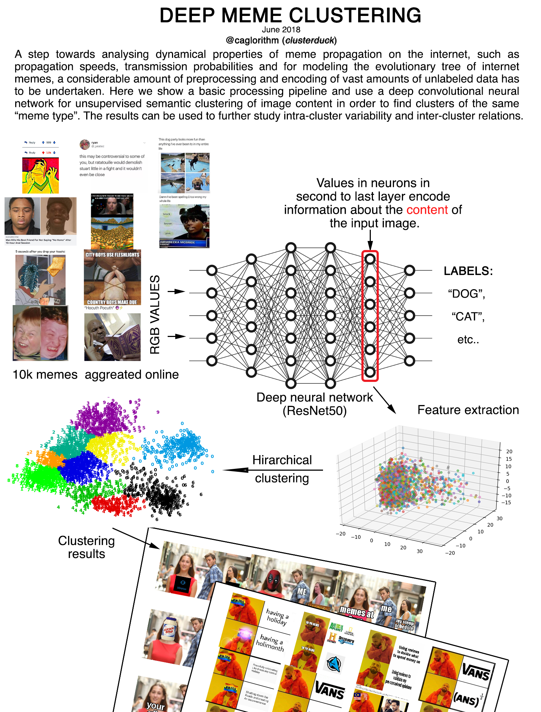
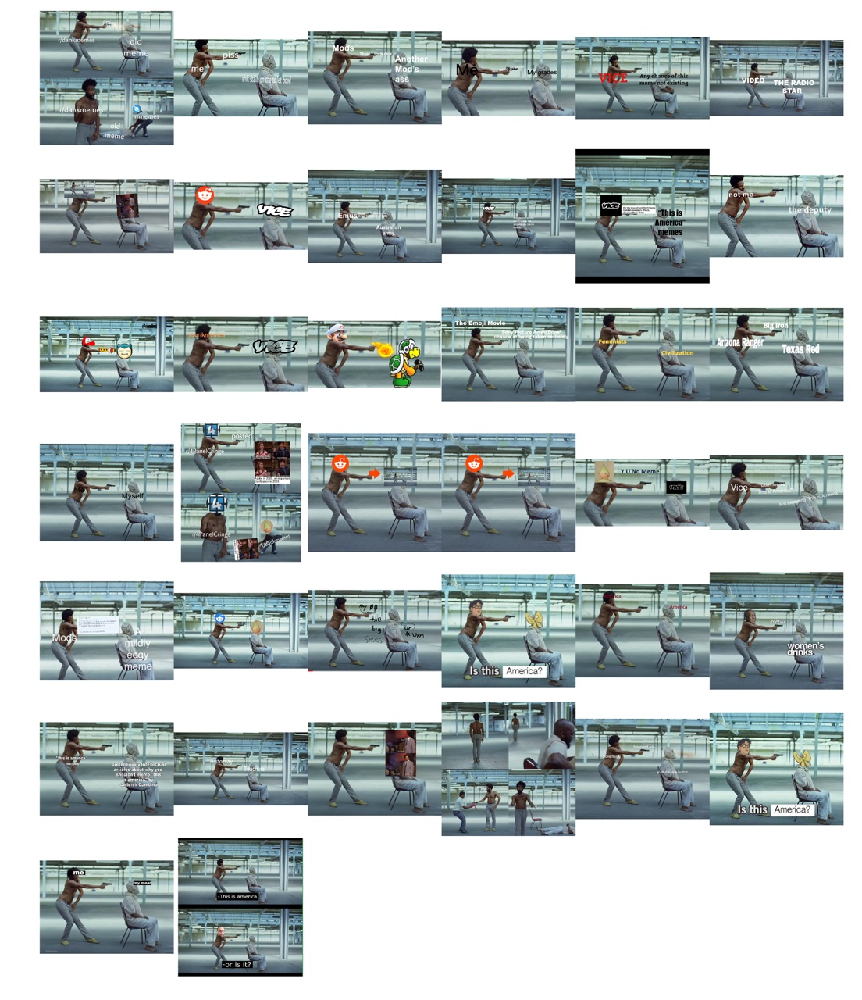
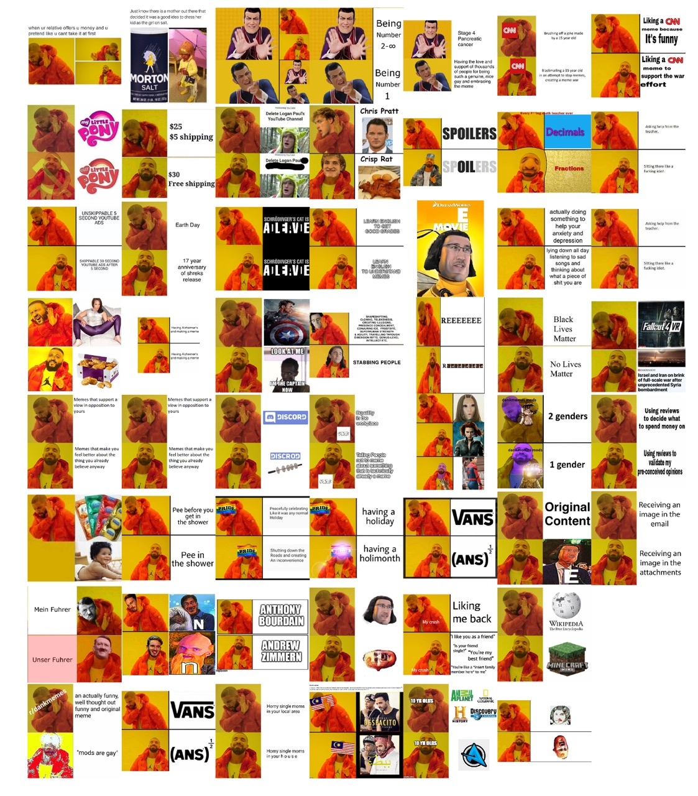
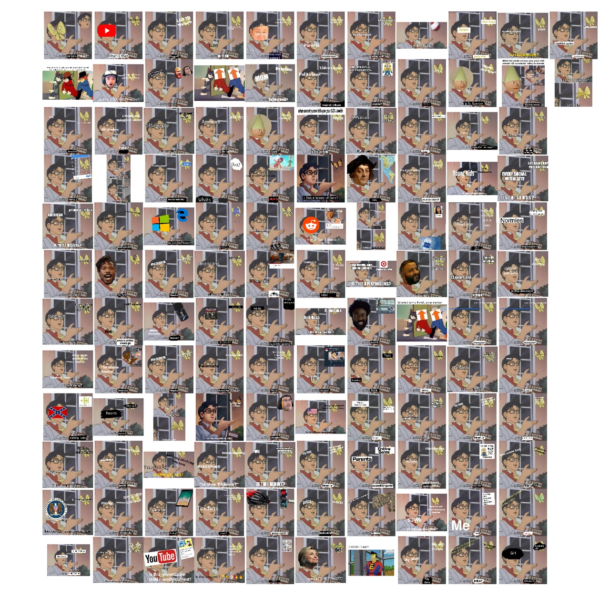
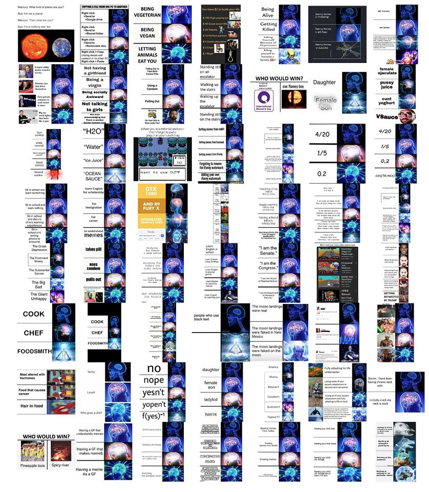
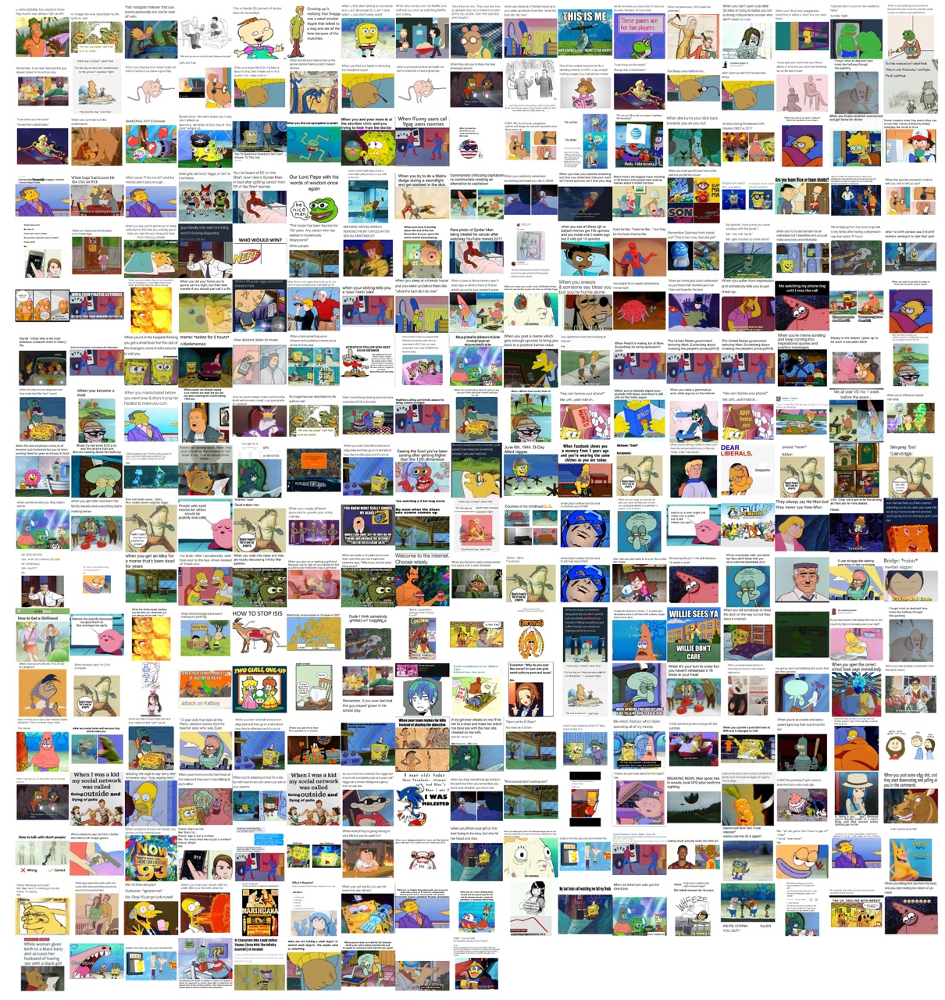

## Dependencies
Depends these python packages: `numpy, pickle, tqdm, imagehash, hashlib, PIL, keras` (tested only with tensorflow)

Pipeline roughly does the following:

    1 - calculates sha256 hash and renames files to hash
    2 - crops out image from meme and copies into ./cropped/
    3 - calculates phash using the imagehash library
    4 - calculates dnn fingerprint using keras and tensorflow
    6 - does the same for cropped versions
    7 - applies a clustering algorithm on fingerprints of cropped images
    8 - plots all members of all clusters into a jpg file and saves results

## Some results

